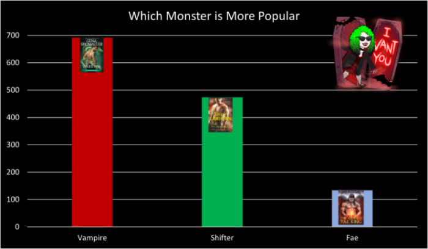

# paranormal_playlist
This is a recommender system that lets you enter a paranormal romance book and get back a list of 20 hair metal songs as a soundtrack.

This was my final project at [allWomen Tech](https://www.allwomen.tech/) data science bootcamp (5/2021-7/2021). 
My video presentation can be seen here: https://youtu.be/Ke0LeeY-LK8?t=1367  
My presentation without narration can be seen here: https://sway.office.com/W0qWgUcxXmIMwpbV?ref=Link  
  
  

The book data:  
I knew I was going to have to scrape the song lyrics, so I thought finding a dataset of books with genres and descriptions would make the project a little easier. Finding the dataset wasn't as easy as I thought it might be, but I managed to find a set I could use on [Kaggle](https://www.kaggle.com/meetnaren/goodreads-best-books). To use this dataset with the notebooks files, follow the instructions inside the get_book_df notebook.

The lyrics data:  
This dataset was going to be more difficult to find. Because I decided to narrow the genre down to only hair bands (bands like Cinderella, Motley Crue, etc), I didn't think there'd be any datasets already put together. Interestingly enough, I managed to find [a repo with lyrics scraped from AZLyrics](https://github.com/SoumitraAgarwal/Webscraping-Text-Data) that included several of the bands I was interested in. I didn't need all the files, so if you want to use the same ones I did, download the files from my repo. 

To Use:  
Start in the books folder to get the initial csv for books.  
After that, start with found lyrics folder.  
In the scraped lyrics folder, the json files that are scraped aren't included but you can download them at [this link](https://github.com/SoumitraAgarwal/Webscraping-Text-Data/tree/master/Song%20Lyrics/Data/Lyrics), which is also linked above. You can also skip this and go directly to the combined_lyrics notebook. Both the found and scraped datasets I cleaned are uploaded to Github, so you can skip the work and download them directly.  
Once the combined lyrics notebook has finished, go to the main folder and work in the book_sountrack notebook to combine everything into one dataframe, do some basic EDA and visualizations, and finally get your song recommendations!

I'd meant to be able to set up a Spotify playlist directly from the book playlist created in the file. I didn't know that I'd need to Spotify track ids and other things to work with the Spotify API. Now I'm going back and getting all the track ids and will update the book_soundtrack and other files to automatically set up a playlist for anyone who puts a book title in. I'd like to get rid of the book database and allow a user to put in any book title, not just for romance books, and then choose the genres of music for their playlist. This would mean I couud get rid of my book dataset and have the title search Amazon or Goodreads for the description. I can't think of how I could get rid of the lyric dataset and expanding it to every musical genre may need more storage than I can deal with on a single computer. I guess I'll have to start small and see how far I can go.

Next Steps:
+ Scrape track numbers from Spotify - either use fuzzy match to work with csv I have or scrape track info and combine csv files
+ Create an app or webapp
+ Allow users to sign into their own Spotify account to create their own playlists
+ Set up automatic scraping of book information
